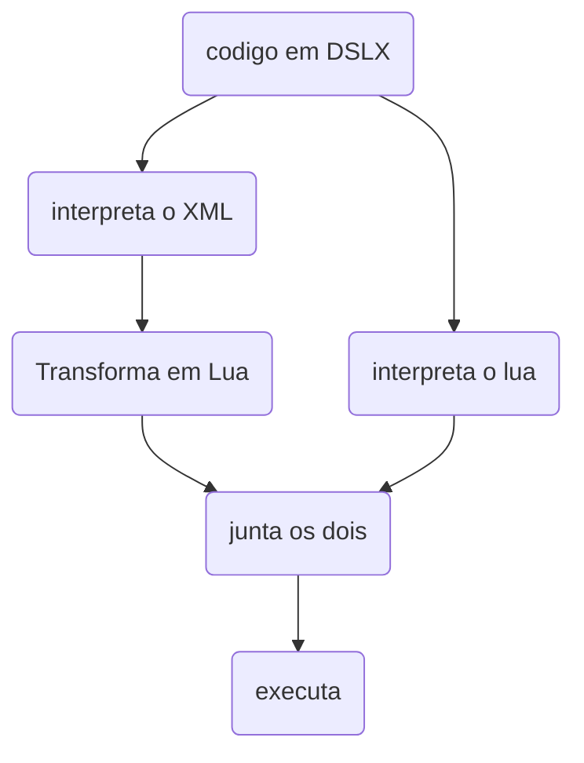

# DLSX - Davi System Lua-XML

<div style="display: flex; justify-content: center; justify-self: left;">
    
    <p>Um interpretador JSX-like para Lua.</p>
    <a href="https://luarocks.org/modules/pessoa736/daviluaxml">
        
    </a>
</div>

> [!WARNING]
> Projeto experimental. APIs podem mudar sem aviso.

## sobre o que se trata o DSLX?

DSLX (ou Davi System: Lua XML) é um módulo que fornece ao Lua a capacidade de interpretar arquivos .dslx no qual permite ler código Lua e transformar o XML em Lua puro num mesmo arquivo e depois executa, parecido com o JSX.

## qual o seu objetivo?

Fazer uma linguagem JSX-like para Lua, com a melhor eficiência, performance, dentro do que for possivel, focando em Lua puro.

## status do projeto

O projeto está em estado experimental, mesmo com uma base da estrutura bem sólida, muitas APIs e muitos conceitos podem mudar a qualquer momento. E bugs são esperados.

## como funciona?



### sintaxe

No .dslx qualquer função definida no ambiente do Lua pode ser chamada no formato do XML.


```lua

-- definindo em Lua
function teste(props)
    local arg1, children = props.arg1, props.children
    
    return arg1 + (children or 0)
end

-- chamando em XML
local res = <teste arg1={1}> {2} </teste>;
print(res) -- isso retornará para o usuario: 3 

-- chamando self-close
print(<teste arg1={2}/>) -- isso mostra pro usuario: 2

```

### importação dos .dslx através do require

Quando seu projeto importa o módulo do DSLX ele carrega o loader do DSLX, sobrepondo o require no ambiente no qual foi importado, permitindo importar o .dslx da mesma forma do .lua

## o que DSLX não é

- **não é html**, html é uma linguagem web para criação de paginas, o DSLX é um Lua+XML. e XML é uma linguagem de estruturação rigida para sistemas.

- **não é um substituto do Lua**, o DSLX é para funcionar em conjunto ao Lua

## porque surgiu?

eu estava afim de desenvolver ferramentas Lua separadas para criar uma framework web na mesma pegada do next.js e react. para isso pensei primeiro em criar um JSX-like so que Lua. comecei pincelando a ideia manualmente e depois fui pedindo ajuda ao copilot.
caso queira da uma olhada como ta o processo de criação da framework: [Pudimweb](https://github.com/pessoa736/PudimWeb)

## licença

Esse módulo é MIT. Sinta-se livre para brincar e fazer o que quiser a sua fork desse projeto, mantendo os créditos :)

## contribuição

Qualquer um pode contribuir com o projeto. Ao encontrar qualquer problema/bug ou se tiver alguma ideia de implementação, pode abrir uma issue para relatar o problema ou fazer um fork com sua implementação.
